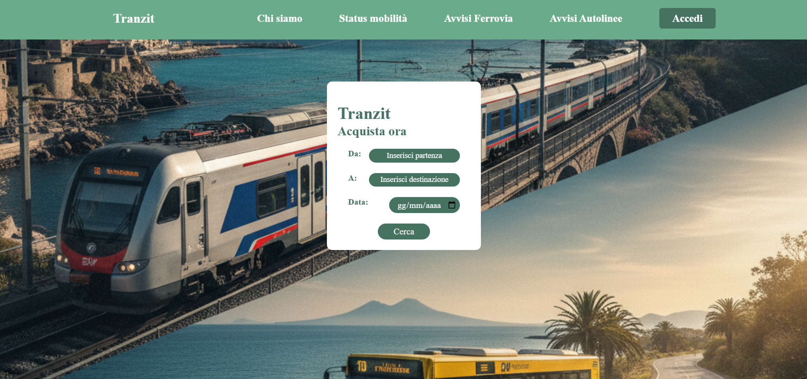

# Tranzit
# Web Tecnologies Project
**Università degli studi di Napoli "Parthenope"** 
**Corso di Laurea in Informatica** 
**Anno accademico: 2025/2026**

## Membri del gruppo
- D'Aniello Eleonora, MAT: **0124002790**
- Alessi Lucia, MAT: **0124002496**
- Incoronato Mattia, MAT: **0124002664**

# 1. Introduzione
È un'applicazione web full-stack progettata per la **ricerca e la consultazione dei biglietti relativi a treni e bus**.  
L'obiettivo è quello di realizzare una piattaforma che sia intuitiva e semplica, ma soprattutto responsiva e dinamica!

# 2. Archittettura del sistema
L'applicazione segue un'architettura di **tre livelli**: 
**Tranzit**: è un'applicazione full-stack sviluppata con:
- **BACKEND**: implementato in Python utilizzando il framework "Flask",che gestisce le rotte, le logiche applicative e le comunicazioni con il database;
- **DATABASE**: basato su MongoDB Atlas, utilizzato per memorizzare le informazioni relative: alle corse, ai biglietti acquistati e agli utenti registrati;
- **FRONTEND**: realizzato con HTML, CSS3 e Javascript, con templating dinamico Jinja 2 per la generazione delle pagine. 

# 3. Tecnologie e strumenti utilizzati
| Livello                   | Tecnologie / Strumenti         |
|---------------------------|--------------------------------|
| **Frontend**              | HTML, CSS3, Javascript, Jinja2 |
| **Backend**               | Python, Flask                  |
| **Database**              | MongoDB Atlas                  |
| **Controllo di versione** | Github, Git                    |
| **Altro**                 | JSON, REST API                 |

# 4. Struttura del progetto
Tranzit/ 
| 
|-- app.py (entry point dell'applicazione Flask) 
|-- templates/ (template HTML, Jinja 2) 
|-- static/ (contiene file CSS3, file javascript e l'immagine di background dell'applicazione) 

# 5. Funzionalità implementate
- Ricerca di corse ferroviarie e relative ai bus;
- Ricerca del tragitto di un treno/bus tramite l'inserimento del codice della corsa;
- Ricerca del biglietto filtrando data e ora di partenza, considerando un luogo di partenza e di destinazione (sono tutte informazioni inserite dall'utente tramite form HTML);
- Se la data di viaggio è quella corrente, vengono ricercati i biglietti con un'orario **UGUALE** o **SUCCESSIVO** a quello registrato dal sistema;
- Consultazione degli avvisi relativi alle linee ferroviarie e autolinee tramite il consulto dei siti relativi alla circolazione offerti da "EAV".  
**Linee ferroviarie**: https://www.eavsrl.it/infomobilita-ferrovia/  
**Autolinee**: https://www.eavsrl.it/avvisi-infomobilita-autolinee/  
- Sistema di registrazione/accesso che consente la visione dei biglietti già prenotati (nella sezione "Miei Viaggi" visibile **SOLO** se è stato effettuato l'accesso);
- Modifica delle informazioni di accesso(email, password e username) tramite una sidebar visibile **SOLO** alle persone registrate;
- Quando si selezionano le località di partenza e di destinazione, vengono mostrati dei menù a tendina con tutte le stazioni registrate nel database che hanno, come iniziali, le lettere inserite dall'utente. Queste opzioni sono selezionabili.

# 6. Fonti dei dati (Open Data)
Il progetto si basa su dati pubblicamente disponibili attraverso piattaforme di **open data**.  
Tali risorse permettono di accedere a informazioni aggiornate e strutturate sui trasporti pubblici, nel rispetto dei principi di trasparenza e riuso dei dati.

Le principali fonti utilizzate sono:

- **Portale Open Data Regione Campania** – informazioni su linee, fermate e orari del trasporto pubblico locale.  
- **GTFS (General Transit Feed Specification)** – standard aperto per la rappresentazione dei dati di transito (orari, percorsi, fermate).

I dataset sono stati scaricati, puliti e importati nel database **MongoDB Atlas** per consentire la ricerca e la consultazione lato utente.

# 7. Screenshot dell'applicazione
Di seguito un'anteprima dell'interfaccia principale di **Tranzit**:

# 8. Video dimostrativo
Per una paronamica sull'utilizzo dell'applicazione è disponibile una demo video a questo link:
https://youtu.be/DrKreUUARDw
